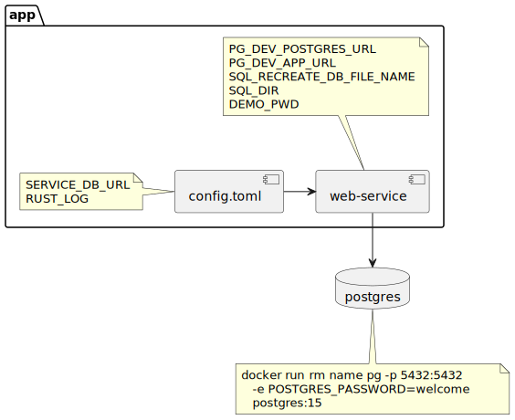
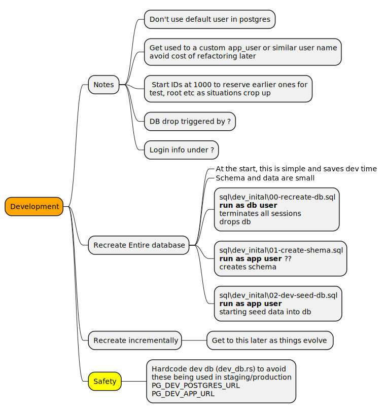
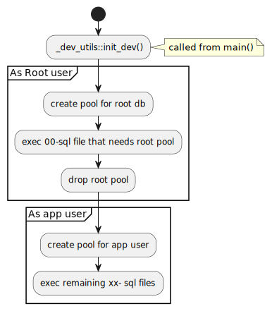
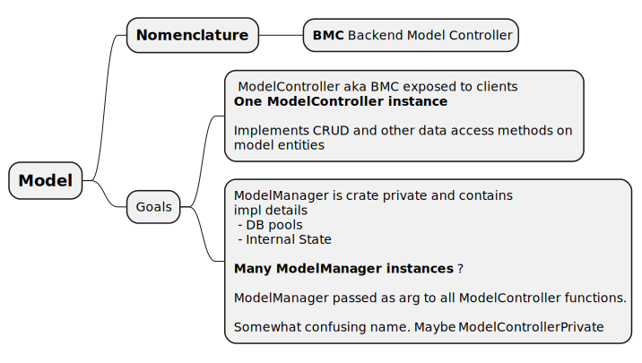
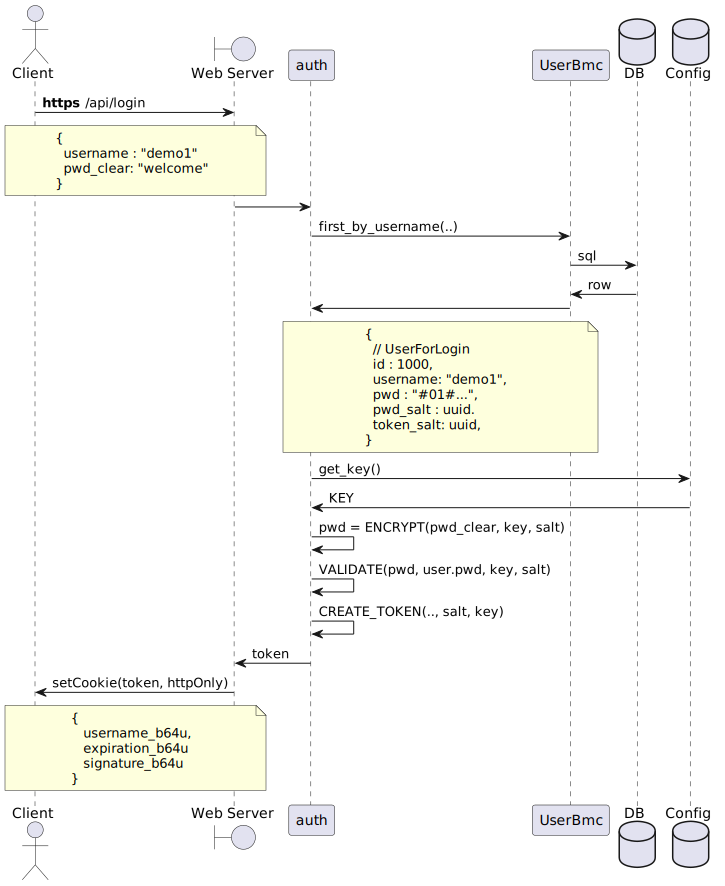
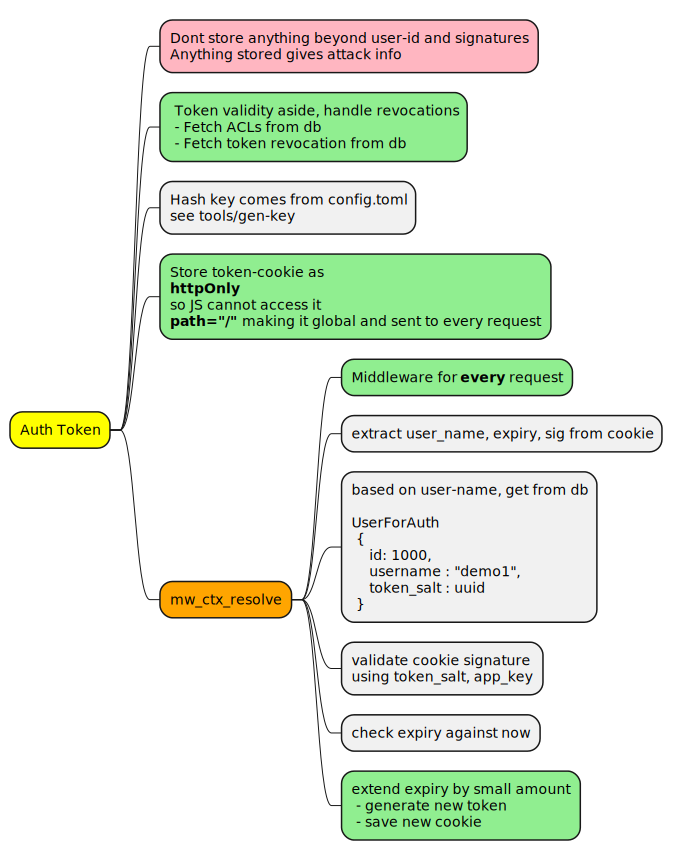
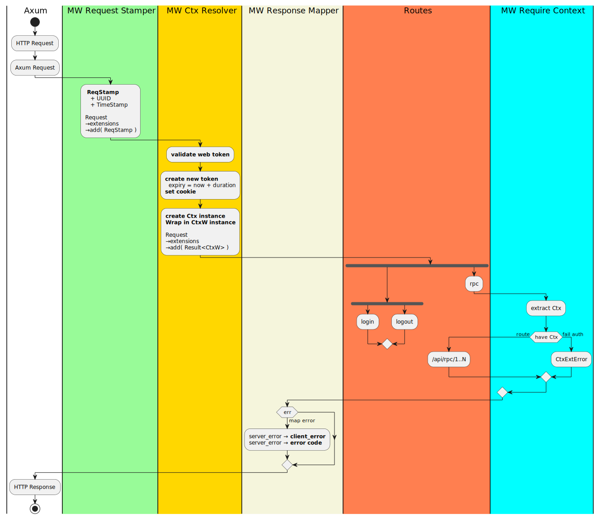

# Rust Web App - All Design diagrams 
<!-- TOC -->

- [Rust Web App - All Design diagrams](#rust-web-app---all-design-diagrams)
    - [Deployment components](#deployment-components)
    - [Initial DB init](#initial-db-init)
    - [Model](#model)
    - [Password encryption and validation](#password-encryption-and-validation)
    - [Secure token and Web Authentication](#secure-token-and-web-authentication)

<!-- /TOC -->

## Deployment components

## Initial DB init

## Model

## Password encryption and validation

## Secure token and Web Authentication

The following mindmap shows the conceptual components involved

And this swim-lane shows the activity sequence involved.

