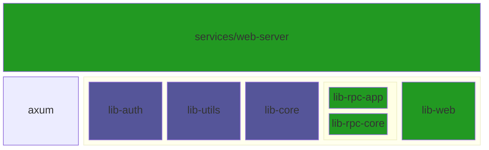
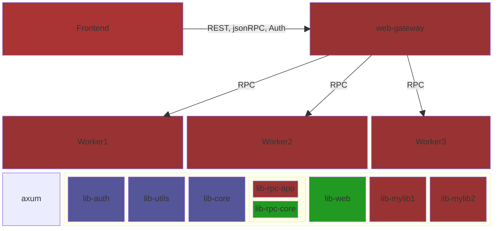

# Proposed changes for rust-web-app

<!-- TOC -->

- [Proposed changes for rust-web-app](#proposed-changes-for-rust-web-app)
    - [Developer Experience Goals](#developer-experience-goals)
        - [Proposed nomenclature](#proposed-nomenclature)
        - [Proposed refactoring split](#proposed-refactoring-split)
        - [Enables this layout](#enables-this-layout)
- [lib-rpc → lib-rpc-core + lb-rpc-app](#lib-rpc-%E2%86%92-lib-rpc-core--lb-rpc-app)
- [service/web-server → service/web-server + lib-web](#serviceweb-server-%E2%86%92-serviceweb-server--lib-web)
- [what about the database dependency ?](#what-about-the-database-dependency-)

<!-- /TOC -->

A lot of high quality library-design and API ergonomics went into Jeremy's library. As a rust newbie, I first have to grok the thought process so I can refactor code and layout the way the author, JChone, might have done himself.

 - ✔️ lib-rc-app
 - ✔️ lib-web
 - ❓ lib-core

split db out
   - Currently the app initializes the db each time it starts. This is done for simplicity and quick development as the seed data neeed is minimal.
   - There is an admonishment in comments that this is for dev only
   - Before I figure this out, I need to have some experience 
      - publishing this to K8s
      - figure out how [init containers](https://kubernetes.io/docs/concepts/workloads/pods/init-containers/) can be used to run initialization (_init db, upgrade schema etc_) before running the service pod
      - see how rust's [profile and profile sensitive features](https://doc.rust-lang.org/cargo/reference/profiles.html) can maybe be useful for switching datastores in dev/stage/prod.
      - come up with `dev`, `staging`, `prod` profiles and see how each can handle DB differently (postgres in dev and staging with cloudSQL in prod), usually staging is a duplicate of prod but likely end up with two functionally different environments, dev and staging/production.
        👉 Looks like same postgres client code can run on both CloudSQL as well as local PostgreSql server.

## Developer Experience Goals

The codebase is high quality. Great developer UX. The desired outcome for the refactoring effort is to maintain that style. 

As a developer client of rust-web-app repo, I want
 - to have my custom code changes
 - and take advantage of updates to the code base
 - all without having to do careful merges. With any large refactoring in upstream code, merge evaluation of downstream (_rust-web-app_) becomes too complex, error-prone and time-consuming.

In life-cycle terms, this means
 - Fork the rust-web-app repo
 - Organize custom code this way
   - 👉 Avoids merges by keeping all custom code in new folders/crates. 
   - 👉 Expect merge to be limited to the `Cargo.toml` and `config.toml` files
   - Write new crates by copying the code from the `demo` crates. Now, this is unfortunately repition of code but then the core-libraries which are the main value prop of rust10x are reused without copying.
 - Maintenance
   - periodically sync fork with upstream
   - Merge workspace `Cargo.toml` file and possibly the `.cargo/config.toml`
   - Less likely, merge the core libraries if any custom changes were made.

### Proposed nomenclature

 - **-demo** suffix
   - A package specifically for demoing how a client library might be constructred
   - Purely to make demo services fully functional.
   - Discard when deploying custom applications
 - **-myapp** suffix   
   - Custom developed code
   - Optionally modeled after _-demo_ pacakges
   - Uses the rest of the lib crates

### Proposed refactoring split

 - green shows the crates that will be affected

### Enables this layout

There are existing off-the-shelf gRPC gateways but if the choice were made to stick to REST/jsonRPC for ease of development, it is fairly trivial to setup a gateway with a `/domain/rpc/` pattern that allows distribution. Either directly to a service or into an event store.

Once binary data use becomes large, there might be a way to automatically take the jsonRPC blocks and generate gRPC protobufs from them and switch to gRPC wholesale. When starting out though, it adds needless complexity in introspection, tracing and such. On top of this, you need a special flavour: `grpc-web` which comes with some limitations and needs Envoy as the gRPC target. So yes, there is a path forward if you need to tune for performance.

To start with, `REST/jsonRPC` from Webclient and communication internal to the cloud deployment.

 - note that **lib-rpc-app** is meant to be an example and the project should be edited to include the model for your specific app.

# lib-rpc → (lib-rpc-core + lb-rpc-app)

See [./Rust10x_REFACTOR_librpc.md](./Rust10x_REFACTOR_librpc.md)

# service/web-server → (service/web-server + lib-web)

See [./Rust10x_REFACTOR_libweb.md](./Rust10x_REFACTOR_libweb.md)

# what about the database dependency ?

There is a lot of baked in database access in this
 - **lib-core** has code to create db-pools (postgres), initialize the tables and so on.
 - **lib-rpc-core** generates CRUD methods for RPC params: awareness of db tables, fields and such.
 - **lib-auth** uses the user tables to authenticate the users and more.

Now. Even if we move to oAuth, something has to be stored. Identifying the user, session etc all need db stuff. So for now, leaving the DB be seems most sensible.

Postgres on k8s via stateful sets is a thing and that can always be done.

