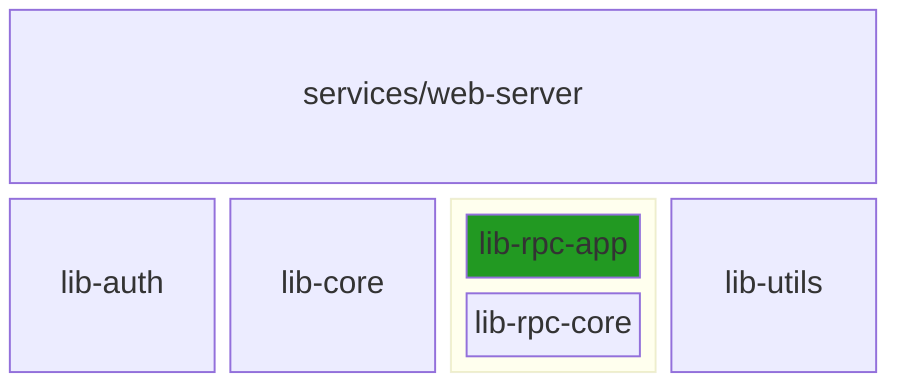

# Refactor lib-rpc

 - [Initial PR](https://github.com/rust10x/rust-web-app/pull/15) _needed squash so closed it and sent another one_
 - [Final PR](https://github.com/rust10x/rust-web-app/pull/17) Merged in.

# Propose - lib-rpc → lib-rpc-core

Same as above. Keep the macros etc in lib-rpc-core and let the client build it's own lib-rpc-myapp

 - rename `generate_common_rpc_fns` to `generate_rpc_crud_fns`

## JChone's direction

I had originally wanted the `conv` and `agent` models in `lib-rpc-demo`. My goal was that 
 - when I sync my fork
 - I take everything he pushes with minimal merge conflicts
 - all my changes do into new folders `lib-rpc-myapp` etc.

He sees this as redundant. The whole thing is a demo, why add another demo-app. [The way he sees it (discord msg)](https://discord.com/channels/937208839609155645/1188336235215851644/1263174486174334976)

> yes, I can see your point, but I think keeping none app related code in a production code become quickly counter productive. 
> 
> So, the point of the blueprint, is for the developer to 
> - fully appropriate the blueprint for their app
> - delete .git create their own git history. 
> - And then, just git clone in a seprate repo, the blueprint, to see the evolution and what they want to bring in. 
>
> There is no universal hammer, and we do not want the bleuprint to become as rigid as a framework.

Made total sense so changed it.

## lib-rpc-app

  - create a new lib at the same level using `cargo new lib-rpc-app --lib`
  - update hillops/Cargo.toml to include this in build
  - `web-server/Cargo.toml` replace `lib-rpc` with `lib-rpc-app`

  - ✔️ Goal to keep this undisturbed when used as client lib

## lib-rpc-core

 - rename `lib-rpc` to `lib-rpc-core`
 - change reference in `Cargo.toml` at top-level

## Details

Was having trouble with the macros. 

 - Even though `use lib_rpc_core::rpcs::prelude::*` was in front, call-site in agent_rpc said the macro was unusable and to import it via `use lib_rpc_core::generate_common_rpc_fns`
 - That import did not do anything but exposed a deeper error
   - `use lib_rpc_core::rpcs::prelude::*`, module `prelude` is not publicly re-exported.
   - I thought the `pub use rpcs::*;` in lib.rs might do it. Maybe I should call it as `use lib_rpc_core::prelude::*`
     - Well this says _could not find `prelude` in `lib_rpc_core`

Finally all done. `quick_dev.rs` works.