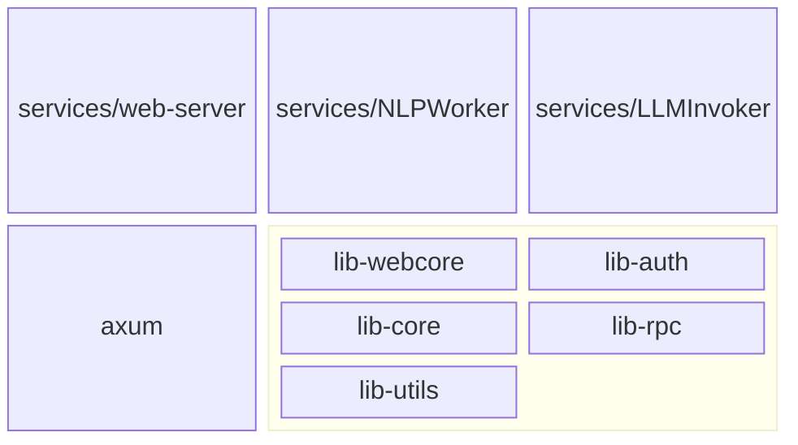

# Proposed changes for rust-web-app

> **final PR** - https://github.com/rust10x/rust-web-app/pull/18


Keeping a log of changes that I think will benefit the overall usability of axum-web repo as a base for other projects. A lot of high quality library-design and API ergonomics went into this library. As a rust newbie, I first have to grok the thought process so I can refactor code and layout the way the author, Chone, might have done himself. I am a guest in his house so to speak, and have to behave accordingly. It is easier as I think similarly when it came to my c++ and systems designs.

Some design criteria
 - Minimize magic and opaque stuff
 - The final `web-service/src/main.rs` can explicitly assemble the routes and layers to provide  easy readability of whats involved. We could have a single function in `lib-web` do this but then discovery would need a client to dig into the library. In any case, multiple services can be built by utilizing different pieces provided by `lib-web`

# Propose - Service/web-server

Chone mentioned that this could be done as needed. Having watched the videos, I think it certainly can. I happen to need this so I can split the web-service into a tree/spoke architecture running on KNative.



## create a new lib-web

```bash
cd rust-web-app/crates/lib
cargo new -l lib-web
```

## logging

move `web-server/src/log` over to `lib-web/src/`
add `mod log` to `lib-web`

## middlewares

All the middlewares are pretty fundamental and can be moved over as is. Detailing per-file high-level changes here. Low-level changes can always be seen from the actual PR diffs.

The supplied web-service uses the model in `lib-core` and the rpc in `lib-rpc-demo`. The goal will be to keep all the `demo` items in the `web-service` and move everything else that could be used by a new client service to `lib-web`.

---
**web/mod.rs**

 - `set_token_cookie` and `remove_token_cookie` both belong in `lib-web`
 - Move as is

## Routes

**web/routes_static.rs**

This uses `web_config().WEB_FOLDER` directly. We have an option to keep the `web_config` with `lib_web` but It makes way more sense to have a config object per-service (_and in full control of the dev client_) instead of a framework library. So we leave ownership of the `web_config` with `web-service` and have it pass the `WEB_FOLDER` value to lib-web.

```diff
-pub fn serve_dir() -> MethodRouter {
+pub fn serve_dir(web_folder: &'static String) -> MethodRouter {
	async fn handle_404() -> (StatusCode, &'static str) {
		(StatusCode::NOT_FOUND, "Resource not found.")
	}

	any_service(
-    ServeDir::new(&web_config().WEB_FOLDER)
+    ServeDir::new(web_folder)
			.not_found_service(handle_404.into_service()),
	)
}
```

and update `main.rs` to supply the web_folder config value as a param.

```diff
let routes_all = Router::new()
		.merge(routes_login::routes(mm.clone()))
		.nest("/api", routes_rpc)
		.layer(middleware::map_response(mw_reponse_map))
		.layer(middleware::from_fn_with_state(mm.clone(), mw_ctx_resolver))
		.layer(CookieManagerLayer::new())
		.layer(middleware::from_fn(mw_req_stamp_resolver))
-   .fallback_service(routes_static::serve_dir());
+   .fallback_service(routes_static::serve_dir(&web_config().WEB_FOLDER));
```

---
**web/routes_rpc.rs**

This has three main parts

 - `RpcInfo` which is generic and belongs in `lib-web`
 - `routes` which builds routes available in `lib-rpc-demo` so belongs at the service level. This stays back in `web-server`
 - `rpc_axum_handler` is generic and belongs in `lib-web`

split accordingly. 
 - `web-server` retains the `routes_rpc.rs` name and `routes` function
 - `lib-web` gets the rest as a new `web\handlers_rpc.rs`

---
**web/routes_login.rs**

 - `routes` which maps `/api/login` and `api/logoff` belongs in `web-server`
 - all other methods move to `lib-web/src/web/handlers_login.rs`

---
**web/mw_res_map.rs**, **web/mw_req_stamp.rs**, **web/mw_auth.rs**

 Can be moved as is into `lib-web`

## Errors

**web/error.rs**

This is a bit involved.

 - `enum Error` already encapsulates errors from helpers as variants. Eg `Pwd(pwd::Error)`,  `Token(token::Error)` etc.
 - `Error` gets an implementation of `client_status_and_error` which maps a limited set of server errors to client error (_mapping the unspecified ones to a generic client error_)
 - `mw_response_mapper` uses `web::Error::slient_status_and_error()` to map the server errors

We can keep this closed but still open it up to the web-server which might want to update the mapping or even replace it entirely.

As a first pass, move it over to `lib-web`. Figure out openining it for customized mapping later on.

---
**./error.rs**

I get that this is a crate-level error. It has limited encapsuation (only `Model(model::Error)`) and used to generate a crate level Result `Result<T, Error>`. This result it used in 

 - `pub async fn log_request(..) -> Result<()> {}` which is used only in `mw_response_map` via `let _ = log_request(..)` and ignores the error anyway.
 - `async fn main() -> Result<()> {..}`
   - uses the `enum Error { [#from] Model(model::Error)}` to wra the model error potentially arising from `ModelManager::new().await`

So, we need this in `web-server` for `main.rs` but not in `lib-web`.

What should I do about this. Simply moving the file over seems to make senses but then I'll need a new `Result` type for `main.rs`.

---

## Refactor errors and module split a bit more.

Since there is effectively only one non-empty `Error` at `lib-web\src\web`, it makes more to bring it up to the module-level.

at the same time, makes sense to refactor the modules further. Module `web` under `lib-web` is not partifularly useful. It'll be more helpful to break the modules into `web` vocabulary sub-components.

```console
└── src
    ├── error.rs ❌
    ├── lib.rs
    ├── log
    │   └── mod.rs
    └── web
        ├── error.rs
        ├── handlers_login.rs
        ├── handlers_rpc.rs
        ├── mod.rs
        ├── mw_auth.rs
        ├── mw_req_stamp.rs
        ├── mw_res_map.rs
        └── routes_static.rs
```

**--into--**

```console
.
└── src/
    ├── error.rs
    ├── lib.rs
    ├── log/
    │   └── mod.rs
    ├── handlers/
    │   ├── mod.rs ➕
    │   ├── handlers_login.rs
    │   └── handlers_rpc.rs
    ├── middleware/
    │   ├── mod.rs ➕
    │   ├── mw_auth.rs
    │   ├── mw_req_stamp.rs
    │   └── mw_res_map.rs
    └── routes/
    │   ├── mod.rs ➕
        └── routes_static.rs
    └── utils/ ➕
    │   ├── mod.rs ➕
        └── token.rs ➕ (split from web/mod.rs)
```

Need to see how JChone would have liked this done. Middleware is a generic web concept name. On the axum side, however, the concepts are different. Since axum is so baked in, makes sense to keep this axum ish. No ?

- **Web Concepts ish**
  - Middleware
  - Handlers
  - Routes

- **Axum Concepts**
  - **Layers**  _they pretty much map to middleware but the intent is clearer when named this way_
  - **Extractors**
  - **Handlers**
  - **Contexts**
  - **State**
  - **Routes**