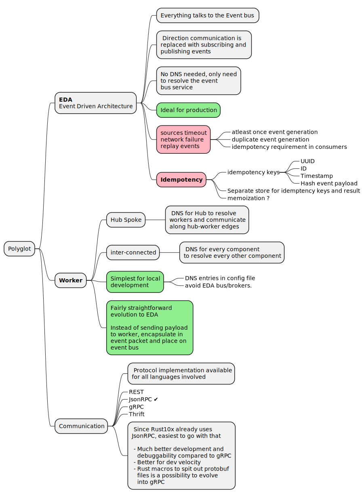
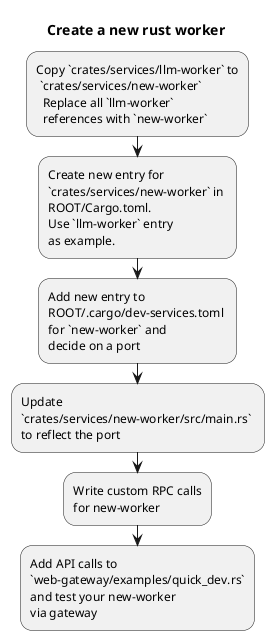
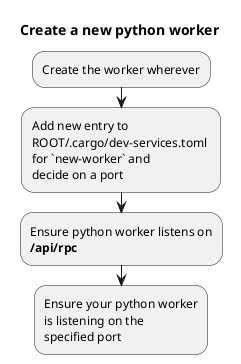
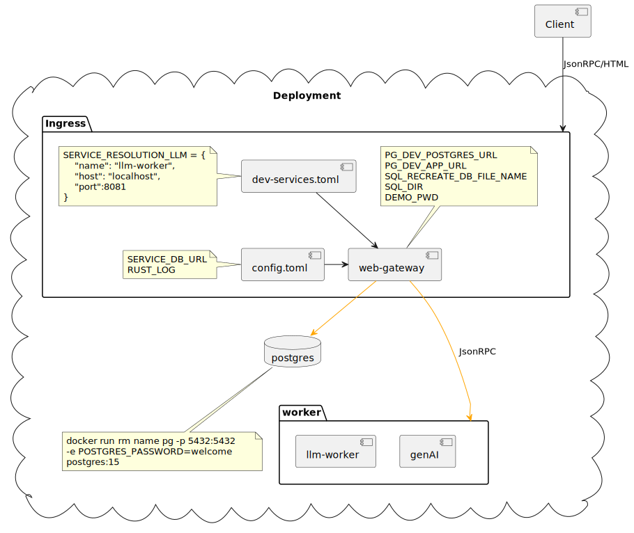

# Worker Architecture

The standard rust10x web-app is a great starting point for many use-cases. However, when you have a need to go polyglot _(primarily integrating python based workers: Langchain, spacy, plain pytorch etc )_, then you have to figure out how to mix it in with rust based web-server acting as the hub.

While the changes involved here were built incrementally, I am not tracing through the iterative development steps. I am simply summarizing the final changes in a top-down fashion.

At the component level, you are looking at mulitple services that communicate in a hub-spoke model. Client request Ingress is via the hub/gateway and the hub hands off requests to the various workers.



Which architecture you decide on, depends on your priorities. When prototyping, I want velocity and simplicity _(as few services as possible, no more databases than absoluteny necessary)_. This then points me to `Worker` with `JsonRPC` communication.

## Creating a new worker

This gets ahead of the documentation in the rest of the document. However, it also gives you a flavour of how easy it is to use this blueprint variant


---




## Worker components

To make just the minimum changes needed and reuse as much of the existing code as possible.

 - extend the rpc URL format of `rpcMethod@http://server/api/rpc` to `rpcMethod@http://gateway/api/rpc/worker`
 - Start simple where worker-name is embedded in the jsonRPC end-point. This is easily extracted from the request without payload (jsonRPC payload i.e.) processing and then dispatched based on an internal worker DNS.
 - reuse `jsonRPC` for the _hub → worker_ communication.


## Single server deployment


## Worker deployment

 - Have gateway handle ingress and auth. All API calls go through this.
 - Gateway will demux the incoming RPC request and route it to appop worker. _Worker name is embedded in incoming RPC method_



Since we now want the app to read from another toml file, it was simplest to use it as a config file. The 

# Code changes

There are multiple big changes that need to be performed to enable a worker architecture. Each of them gets its own document. In most cases, there was a lot of incrmental testing _(each worker is a full-blown rust-web-app after all)_.
 
 
  - [Worker service resolution](./Worker_ServiceResolution.md) 
    - Registry information resolving worker names to IPs in development. Production is TBD but likely k8s config.
  - [RPC changes to allow request demuxing](./RPC_RoutingChanges.md) 
    - RPC dispatch code to either dispatch or redirect to a worker based on URL format
    - Limit Cookie auth_token handling to gateway but use a similar middleware in the workers. Gateway to pack the user context into the header for the request to the worker.
  - [LLM Worker using rust-genai](./LLM_Worker.md)
    - expect `Ctx` serialied into a HTTP request header value
    - Replace `ctx_resolver` with a `ctx_leaf_resolver`
    - Use `rust-genai` library
    - create new RPC methods
  - [Request UUID Chain to track request across services](./UUID_RequestCallChain.md) 
    - Generalize the per RPC call UUID into a chain so that a worker can log the source UUID along with it's worker UUID to enable better tracing.
    - worker trace shows things like this: `"rpc_chain":["748eaa50-b8d3-47d6-a4f2-a0b0c8b90850@web-gateway"]` indicating upstream request-uuid and upstream process name.

# Worker deployment In use

After all of these, this function in `quick_dev.rs`

```rust
// -- worker calls via gateway
//
// Note the `"method": "llm-worker/one_shot_msg"` which indicates that
// `"method" : "one_shot_msg"` should be sent to the `llm-worker` worker.
{
    let req_llm_msg = hc.do_post(
        "/api/rpc",
        json!({
            "jsonrpc": "2.0",
            "id": 1,
            "method": "llm-worker/one_shot_msg",
            "params": {
                "data": {
                    "prompt": "why is the sky blue",
                    "mode" : "System"
                }
            }
        }),
    );
    let result = req_llm_msg.await?;
    result.print().await?;
}
```

results in these three traces

---

**quick_dev.rs execution host**

```log
=== Response for POST http://localhost:8080/api/rpc
=> Status         : 200 OK OK
=> Headers        :
   content-type: application/json
   content-length: 282
   set-cookie: auth-token=ZGVtbzE.MjAyNC0wNy0yM1QyMDo1MToxMS45NTA4MzE4NDJa.xXSC5o0uhLX3zNeKn7DJEmsyM0h1clqO6MN-P4o2TkolFXMEKUD-_ABfQnMMWX4B_KMHzLqPSvgDu0eELQvWFg; HttpOnly; Path=/
   date: Tue, 23 Jul 2024 20:21:11 GMT
=> Response Cookies:
   auth-token: ZGVtbzE.MjAyNC0wNy0yM1QyMDo1MToxMS45NTA4MzE4NDJa.xXSC5o0uhLX3zNeKn7DJEmsyM0h1clqO6MN-P4o2TkolFXMEKUD-_ABfQnMMWX4B_KMHzLqPSvgDu0eELQvWFg
=> Client Cookies :
   auth-token: ZGVtbzE.MjAyNC0wNy0yM1QyMDo1MToxMS45NTA4MzE4NDJa.xXSC5o0uhLX3zNeKn7DJEmsyM0h1clqO6MN-P4o2TkolFXMEKUD-_ABfQnMMWX4B_KMHzLqPSvgDu0eELQvWFg
=> Response Body  :
{
  "id": 1,
  "jsonrpc": "2.0",
  "result": {
    "data": {
      "response": "The sky appears blue because of a phenomenon called Rayleigh scattering, in which shorter (blue) wavelengths of light are scattered more than longer (red
      ) wavelengths by the tiny molecules of gases in the Earth's atmosphere."
    }
  }
}
===
```
---

**web-gateway trace**

```log
INFO FOR-DEV-ONLY - init_dev_all()
INFO FOR-DEV-ONLY - init_dev_db()
INFO FOR-DEV-ONLY - pexec: "/home/vamsi/bitbucket/hillops/sql/dev_initial/00-recreate-db.sql"
INFO FOR-DEV-ONLY - pexec: "/home/vamsi/bitbucket/hillops/sql/dev_initial/01-create-schema.sql"
INFO FOR-DEV-ONLY - pexec: "/home/vamsi/bitbucket/hillops/sql/dev_initial/02-dev-seed.sql"
INFO FOR-DEV-ONLY - init_dev_db - set demo1 pwd
INFO LISTENING    - Ok(127.001:8080)
DEBUG MIDDLEWARE   - mw_req_stamp_resolver
DEBUG MIDDLEWARE   - mw_ctx_root_resolver
DEBUG EXTRACTOR    - CtxW
DEBUG EXTRACTOR    - ReqStamp
DEBUG HANDLER      - api_login_handler
DEBUG EXTRACTOR    - ReqStamp
DEBUG HANDLER      - api_login_handler
DEBUG RES_MAPPER   - mw_reponse_map
DEBUG REQUEST LOG LINE:
{"duration_ms":409.674,"http_method":"POST","http_path":"/api/login","time_in":"2024-07-23T20:21:11.53795666Z","timestamp":"2024-07-23T20:21:11.947631445Z","uuid":"3fbcd3f4-0d75-4795-9aaa-e457eea447ad"}
DEBUG
DEBUG MIDDLEWARE   - mw_req_stamp_resolver
DEBUG MIDDLEWARE   - mw_ctx_root_resolver
DEBUG EXTRACTOR    - CtxW
DEBUG EXTRACTOR    - ReqStamp
DEBUG EXTRACTOR    - CtxW
DEBUG MIDDLEWARE   - mw_ctx_require - Ok(CtxW(Ctx { user_id: 1000, conv_id: None }))
DEBUG EXTRACTOR    - CtxW
DEBUG RPC Dispatch - Split "llm-worker/one_shot_msg" into service="llm-worker" and method="one_shot_msg"
INFO FOR-DEV-ONLY - Initialize service resolution from config.toml/env
INFO INIT         - Service llm-worker → http://localhost:8081
INFO INIT         - Service vision-worker → http://localhost:8082
DEBUG RPC Dispatch - Resolved "llm-worker" to "http://localhost:8081/api/rpc"
DEBUG RPC Dispatch - WebResponse status 200
DEBUG RES_MAPPER   - mw_reponse_map
DEBUG REQUEST LOG LINE:
{"duration_ms":386.804,"http_method":"POST","http_path":"/api/rpc","rpc_id":"1","rpc_method":"llm-worker/one_shot_msg","time_in":"2024-07-23T20:21:11.949339975Z","timestamp":"2024-07-23T20:21:12.336144444Z","user_id":1000,"uuid":"748eaa50-b8d3-47d6-a4f2-a0b0c8b90850"}
```

Note the following

 - `Split "llm-worker/one_shot_msg" into service="llm-worker" and method="one_shot_msg"`
 - `Service llm-worker → http://localhost:8081`
 
---

**llm-worker trace**

```log
INFO LISTENING    - Ok(127.0.0.1:8081)

DEBUG MIDDLEWARE   - mw_req_stamp_resolver
DEBUG MIDDLEWARE   - mw_ctx_leaf_resolver
DEBUG EXTRACTOR    - CtxW
DEBUG MIDDLEWARE   - mw_ctx_leaf_resolver
DEBUG EXTRACTOR    - CtxW
DEBUG EXTRACTOR    - ReqStamp
DEBUG EXTRACTOR    - CtxW
DEBUG MIDDLEWARE   - mw_ctx_require - Ok(CtxW(Ctx { user_id: 1000, conv_id: None }))
DEBUG EXTRACTOR    - CtxW
DEBUG RPC          - one_shot_msg - Ctx { user_id: 1000, conv_id: None }, ParamsW { data: OneShotMsg { mode: System, prompt: "why is the sky blue" } }
DEBUG RES_MAPPER   - mw_reponse_map
DEBUG REQUEST LOG LINE:
{"duration_ms":376.795,"http_method":"POST","http_path":"/api/rpc","rpc_chain":["748eaa50-b8d3-47d6-a4f2-a0b0c8b90850@web-gateway"]"rpc_id":"1","rpc_method":"one_shot_msg","time_in":"2024-07-23T20:21:11.957829191Z","timestamp":"2024-07-23T20:21:12.334624225Z","user_id":1000,"uuid":"da705c12-f089-432f-a72e-e48e62d3a83b"}
```


Note the following

 - `mw_ctx_leaf_resolver`
 - `mw_ctx_require - Ok(CtxW(Ctx { user_id: 1000, conv_id: None }))` shows Ctx successfully sent from gateway and resolved on worker
 - 👉 `"rpc_chain":["748eaa50-b8d3-47d6-a4f2-a0b0c8b90850@web-gateway"]` which ties the llm-worker's `"uuid":"da705c12-f089-432f-a72e-e48e62d3a83b"` reqest-uuid to the upstream originating request-uuid of `"748eaa50-b8d3-47d6-a4f2-a0b0c8b90850"` originating from `web-gateway` process.