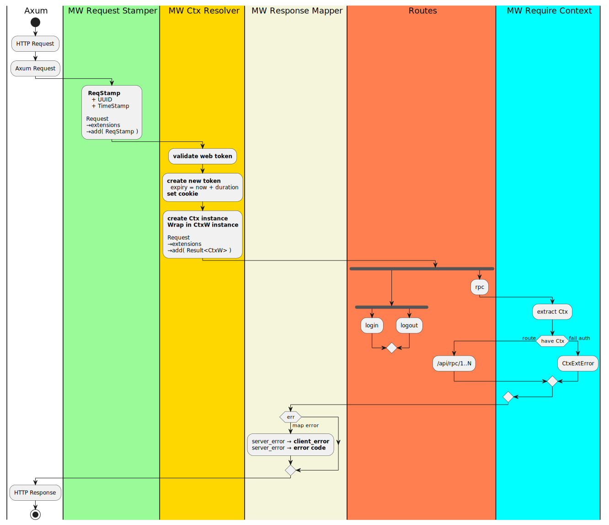

<!-- TOC -->

- [The LLM worker](#the-llm-worker)
    - [Creating the new worker](#creating-the-new-worker)
    - [Auth and Context](#auth-and-context)
    - [Differences expected between web-server/web-gateway and a worker](#differences-expected-between-web-serverweb-gateway-and-a-worker)
    - [ctx_leaf_resolver](#ctx_leaf_resolver)
    - [adding genai dependency](#adding-genai-dependency)
    - [wrapping genai errors.](#wrapping-genai-errors)
    - [The actual llm-worker API end-points](#the-actual-llm-worker-api-end-points)
    - [Unit testing](#unit-testing)
- [Addendum](#addendum)

<!-- /TOC -->

# The LLM worker

I want to create a worker that handles communication to an LLM API. While there are quite a few provider specific rust libraries, I have chosen to use Jeremy Chone's [rust-genai](https://github.com/jeremychone/rust-genai) crate as it'd allow me to talk to multiple LLM providers.

## Creating the new worker

A worker is very similar to the main web-server. You can create it in two ways
 
 - Create it new via `cargo new llm-gateway --lib` and adjust the Cargo.toml as needed. But since it is functionally mostly the same as the `web-gateway`, this is needlessly painful.
 - Or copy `services/web-gateway` into `services/llm-worker` and then search-replace all _web-gateway_ references to _llm-worker_.
   - Much easier.
   - Most of the files are also the same with some minor differences.

I simply copied the source of web-gateway as the strting point.

## Auth and Context

Use the auth sequence of `web-server` _(now web-gateway)_ as a reference



and this is setup in `main.rs` via

```rust
let routes_all = Router::new()
		.merge(routes_login::routes(mm.clone()))
		.nest("/api", routes_rpc)
		.layer(middleware::map_response(mw_reponse_map))
		.layer(middleware::from_fn_with_state(mm.clone(), mw_ctx_root_resolver))		
		.la
    yer(CookieManagerLayer::new())
		.layer(middleware::from_fn(mw_req_stamp_resolver))		
		.fallback_service(routes_static::serve_dir(&web_config().WEB_FOLDER));
```

The biggest difference between this and the flow of a worker is expected to be in how auth is resolved. That is analyzed next.

## Differences expected between web-server/web-gateway and a worker


> The above image is a combination of the ease of a PlantUML diagram, colors to highlight nodes and the insertion of approp unicode characters (<kbd>Win+.</kbd> characters for `tick`, `cross` and `plus`. Simple tools for such effective visualization!

I want to re-use as much of the code from `web-gateway` in each worker as possible. The differences highlighted should be performed with minimal code changes if possible.

 - `login/logout` is only performed in the gateway. So these routes will be removed from all workers.
 - `mw_ctx_resolver` resolves the auth-token in cookie _(from browser or http client calling the API)_ into a `Ctx` object which contains the authenticated user information. To clarify the semantics and reduce confusion, I have renamed this to a **root** resolver in the gateway and am calling the worker resolvers: **leaf**. 
 - `mw_leaf_ctx_resolver` will take the place of `mw_ctx_resolve` on the worker side. Instead of resolving user ctx from a cookie, hitting the DB etc, it will resolve the information already resolved by the `root_resolver` in the web-gateway _(via the HTTP header of the jsonRPC call, much like a cookie)_.

>I had spent an inordinate amount of time figuring out approp names for the ctx_resolvers: Among then, `(Auth0, Auth1)`, `(Auth0, AuthZ)`. However, many of them either refer to existing companies, `Auth0` for instance or have other abbreviations: _(AuthentcatioN → AuthN)_ and _(AuthoriZation → AuthZ)_. So `root` and `leaf` it is.

The final worker axum setup will have the following changes compared to the gateway.

```diff
let routes_all = Router::new()
-		.merge(routes_login::routes(mm.clone()))
		.nest("/api", routes_rpc)
		.layer(middleware::map_response(mw_reponse_map))
-		.layer(middleware::from_fn_with_state(mm.clone(), mw_ctx_root_resolver))		
+		.layer(middleware::from_fn(mw_ctx_leaf_resolver))
		.layer(CookieManagerLayer::new())
		.layer(middleware::from_fn(mw_req_stamp_resolver))		
-		.fallback_service(routes_static::serve_dir(&web_config().WEB_FOLDER));
+   ;
```

## ctx_leaf_resolver

`ctx_leaf_resolver` is placed in the same `lib_web/src/middleware/mw_auth.rs` and is defined thus

```rust
pub async fn mw_ctx_leaf_resolver(
	mut req: Request<Body>,
	next: Next,
) -> Response {
	debug!("{:<12} - mw_ctx_leaf_resolver", "MIDDLEWARE");

	let ctx = ctx_from_req_header(&req.headers())		
		.map_err(|ex| CtxExtError::CtxCreateFail(ex.to_string()));	

	// store the ctx in request extension
	// Note that this can be an Error. Will 
	// be validated later
	req.extensions_mut().insert(ctx);

	next.run(req).await
}
```

`ctx_from_req_headers` simply deserilaizes the serialized `Ctx` in the header. For reference, I am also showing the code that puts the serialized `ctx` into a _(`headerKey`, `headerValue`) pair.

```rust
pub(crate) const AUTH1_HEADER_KEY: &str = "X-WORKER-POSTAUTH";

// Sticks the serialized `ctx` into a (key, value) pair meant 
// to go into a web_client request header
pub fn get_ctx_headers(ctx: &Ctx) -> Result<(String,String)> {
	Ok(
		( AUTH1_HEADER_KEY.to_string(), serde_json::to_string(&ctx)?)	
	)
}

// De-serializes the context supplied by `get_ctx_headers` on the 
// worker side of the request.
pub fn ctx_from_req_header(headers: &HeaderMap) -> Result<CtxW> {
	let pa_tok_val = headers
		.get(AUTH1_HEADER_KEY)
		.ok_or(Error::CtxExt(CtxExtError::CtxPostAuthTokenNotInReqHeader))?
		.to_str()
		.map_err(|_| Error::CtxExt(CtxExtError::CtxPostAuthTokenBadFormat))?;

	let ctx:Ctx = serde_json::from_str(pa_tok_val)?;
	Ok(CtxW(ctx))
}
```

## adding genai dependency

I have decided to use `rust-genAI` for now as the `llm` provider API. New dependency in `cargo.toml`. Latest available rust-genAI as of Nov 2024.

```diff
[dependencies]
+ genai = "=0.1.10"  #version lock for 0.1.x
```

## wrapping genai errors.

This is part of the rust10x philosophy. Any thirdparty error is best wrapped into your crates errors. This is usually pretty straightforward. Beyond the usual boilerplate, I needed to derive from `RpcHandlerError` and created a new `GenAI` wrapper to grap the `genai::Error` classes from `rust-genAI`. 

I get serde complaints that it is not serializable. Had to figure this out with some special serde fix.
 - `#[from]` is the usual `From` derivation that `?` needs
 - However, `[serde_as]` cannot be applied to enums, only struct fields. The trick here is to put it inside the `GenAI` variant.

```rust
#[serde_as]
#[derive(Debug, From, Serialize, RpcHandlerError)]
pub enum Error {
	// -- Modules
	#[from]
	Model(model::Error),

	#[from]	
	GenAI(
		#[serde_as(as = "serde_with::DisplayFromStr")]
		genai::Error
	),

	RpcError
}
```


## The actual llm-worker API end-points

> 👉 Find these under
> ```
> llm-worker/src/rpc/
> ├── genai_chat_rpc.rs
> ├── genai_model_rpc.rs
> └── mod.rs
>```

If you study the macro `generate_common_rpc_fns`, it uses `ParamsForCreate`, `ParamsIded`, `ParamsList` and `ParamsForUpdate` to generate the CRUD functions in `lib_rpc_app`. While I could have used any of them and ignored the semantics, it would be confusing.

Turns out, it is fairly easy _(I forget the intermediate motivating steps tho but have the final result)_ to create a new wrapper with semantics that mean `simply pass the args through`. Finally ended up with the following RPC `RouterBuilder` invocation for `one_shot_msg` and `get_model_list`.

```rust
use lib_rpc_core::prelude::*;

use serde::Deserialize;
use rpc_router::IntoParams;
use serde::de::DeserializeOwned;

mod genai_chat_rpc;
use genai_chat_rpc::one_shot_msg;

mod genai_model_rpc;
use genai_model_rpc::get_model_list;

/// Equivalent to 
///  RouterBuilder::default()
///     .append_dyn("one_shot_msg", one_shot_msg.into_box())
///
pub fn rpc_router_builder() -> RouterBuilder {
    router_builder!(
        one_shot_msg,
        get_model_list
    )
}


//-- Infra extension for wrapping params ------------
/// Params structure for any RPC pass-through call.
#[derive(Debug, Deserialize)]
pub struct ParamsW<D> {
	pub data: D,
}

impl<D> IntoParams for ParamsW<D> where D: DeserializeOwned + Send {}
```

My notes say that I simply need to provide a `IntoParams` implementation where the wrapped type should be `DeserializeOwned + Send`. I think this just translated to it implementing `Clone` and ultimately `Deserialize`. The payloads ended up looking like this:

```rust
use lib_rpc_core::prelude::*;
use crate::error::{Result, Error};
use crate::rpc::ParamsW;

use serde::{Deserialize, Serialize};

//-- Handler message params --------------------------
#[derive(Debug, Clone, Deserialize)]
pub enum ChatUserMode {
    System,
    User,
    Assistant
}

#[derive(Debug, Clone, Deserialize)]
pub struct OneShotMsg {
    pub mode: ChatUserMode,
    pub prompt: String,
}

#[derive(Debug, Clone, Serialize)]
pub struct OneShotMsgResponse {
    pub response: String,    
}
```

with the actual RPC method looking like 

```rust
//-- Handler RPC  -----------------------------------
pub async fn one_shot_msg(
    ctx: Ctx,
    _mm: ModelManager,
    params: ParamsW<OneShotMsg>,) 
-> Result<DataRpcResult<OneShotMsgResponse>> {
    
    debug!("{:<12} - one_shot_msg - {ctx:?}, {params:?}", "RPC");

    let ParamsW{data: osm} = params;

    // Ugly for now but can cache behind a conv_id later
    let client = Client::default();
	let mut chat_req = ChatRequest::default().with_system("Answer with one sentence");        
    chat_req = chat_req.append_message(ChatMessage::user("Why is the sky blue"));

    // Default chose the free Groq one. Later can allow choosing of provider/model.
    //let model = "gpt-4o-mini";
    let model = "llama3-70b-8192";

     // Add the incoming msg
     chat_req = chat_req.append_message(
        match osm.mode {
            ChatUserMode::System => ChatMessage::system(osm.prompt),
            ChatUserMode::User => ChatMessage::user(osm.prompt),
            ChatUserMode::Assistant => ChatMessage::assistant(osm.prompt),
        }
    );
    
    // see https://github.com/jeremychone/rust-genai/blob/HEAD/examples/c00-readme.rs
    // for examples
    let chat_response = client.exec_chat(model, chat_req.clone(), None)
        .await
        .map_err(|_| Error::RpcError)?;    

    let response_text = chat_response.content_text_as_str()
        .unwrap_or("No Naswer from LLM");    

    // Pack response
    let ret = OneShotMsgResponse{
        response: response_text.to_string(),
    };

    Ok(ret.into())
}
```

> 👉 If you want to exercise this further. See if you can convert most of the examples under rust-genai to rpc end-points in llm-worker. I have done it for one API method `all_model_names()`. You can use that as a starting point.

## Unit testing

Since the worker code is expected to be called from the gateway, I simulated sending the context and ended up with the following boilerplate code under `llm-worker/examples/quick_dev.rs`. There were some limitations in JChone's http-test _(which is based on Reqwest and which is what is used in other quick_dev)_, iirc, you could not set headers in `http-test`. So ultimately, I had to go a level lower and use `reqwest` directly with some duplicate code. Did not want to root-cause and send a PR for http-test as I was quite pressed for time and just wanted this completed.

```rust
#![allow(unused)] // For example code.

pub type Result<T> = core::result::Result<T, Error>;
pub type Error = Box<dyn std::error::Error>; // For examples.

use serde_json::{json, Value};

use reqwest::{Url, header, ClientBuilder, Client};

use lib_core::ctx::Ctx;

// Don't know enough to avoid this.
// This takes reqwest::http::header::HeaderMap while
// mw_auth::set_auth1_header takes an axum::http::header::HeaderMap
fn set_ctx_leaf_header(ctx: &Ctx, headers: &mut header::HeaderMap) -> Result<()> {
	let mut header_val = header::HeaderValue
		::from_str(&serde_json::to_string(&ctx)?)
		.unwrap();

	header_val.set_sensitive(true);
	headers.insert("X-WORKER-POSTAUTH", header_val);

	Ok(())
}

#[tokio::main]
async fn main() -> Result<()> {

	// -- Send a RPC request with a post-auth header		
	let ctx_val = Ctx::new(1001)?;		

	// Send this via headers as a sensitive value
	// printout will just show 
	// {"x-worker-postauth": Sensitive}
	// https://play.rust-lang.org/?version=stable&mode=debug&edition=2021
	let mut request_headers = header::HeaderMap::new();
	set_ctx_leaf_header(&ctx_val, &mut request_headers);		

	let client_builder = ClientBuilder::new()
		.default_headers(request_headers);

	let hc = httpc_test::new_client_with_reqwest(
		"http://localhost:8081",
		client_builder
	)?;

  ....various test functions ...
```

I used the following test function

```rust
// - one_shot_msg
{
  let req_llm_msg = hc.do_post(
    "/api/rpc",
    json!({
      "jsonrpc": "2.0",
      "id": 1,
      "method": "one_shot_msg",
      "params": {
        "data": {
          "prompt": "why is the sky blue",
          "mode" : "System"
        }
      }
    }),
  );
  let result = req_llm_msg.await?;
  result.print().await?;
}
```

Finally it all works! Yay!!

```console

=== Response for POST http://localhost:8081/api/rpc
=> Status         : 200 OK OK
=> Headers        :
   content-type: application/json
   content-length: 266
   date: Sun, 21 Jul 2024 19:05:17 GMT
=> Response Body  :
{
  "id": 1,
  "jsonrpc": "2.0",
  "result": {
    "data": {
      "response": "The sky appears blue because of the way that shorter (blue) wavelengths of light are scattered in all directions by the tiny molecules of gases in the Earth's atmosphere, making them more visible to our eyes."
    }
  }
}
===
```

# Addendum

I went through quite some iterations to arrive at the code above. I have copious notes on the errors encountered and how I either fixed them or ignored them. If you need more details, send me a msg.

Also, see [CodingChallengesAndTips.md](./CodingChallengesAndTips.md)

