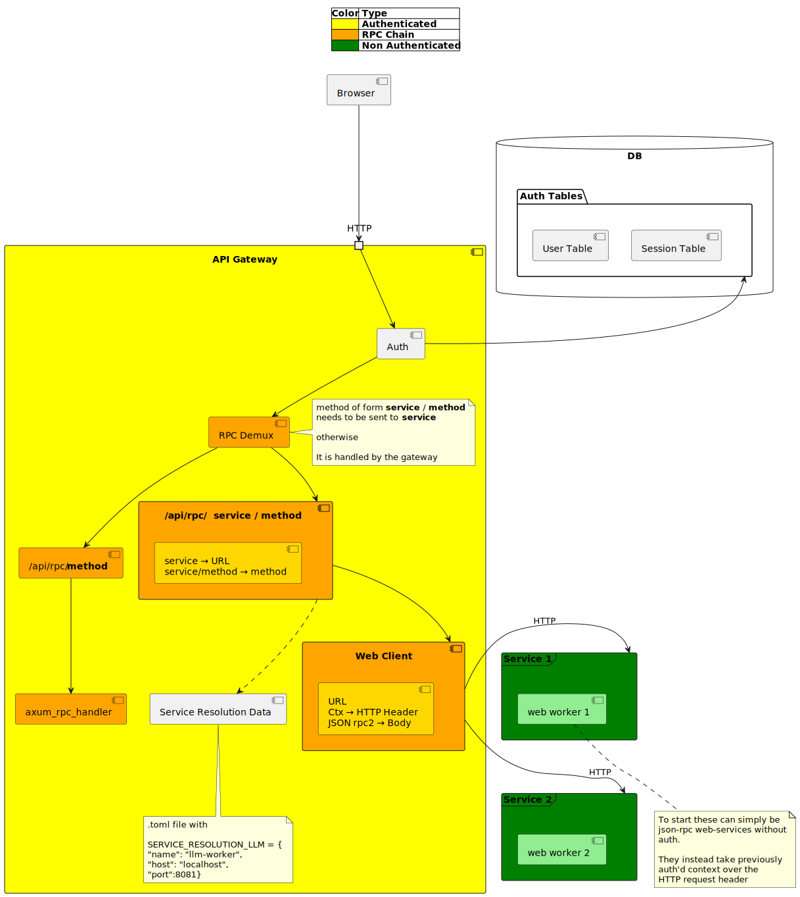
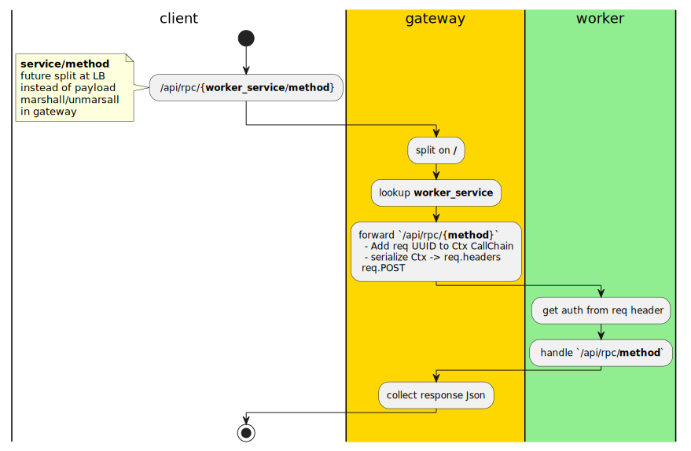

<!-- TOC -->

- [RPC routing changes in rust-web-app enabling worker architecture](#rpc-routing-changes-in-rust-web-app-enabling-worker-architecture)
    - [Target highlevel flow](#target-highlevel-flow)
    - [The RPC portion](#the-rpc-portion)
    - [Code changes](#code-changes)
        - [Refactor and split-out in-proc rpc handling.](#refactor-and-split-out-in-proc-rpc-handling)
        - [Code to decide inproc vs worker-dispatch](#code-to-decide-inproc-vs-worker-dispatch)
        - [Worker dispatch](#worker-dispatch)

<!-- /TOC -->

# RPC routing changes in rust-web-app enabling worker architecture

The goal of this change is changes to the rpc routing code so that the `gateway` server can figure out which RPC calls to route to a worker.

## Target highlevel flow



## The RPC portion

The rpc portion of rust-web-app is handled at a low level. Since `auth` is baked in from the start, I need to ensure that authentication contexts are validated as usual at the gateway and sent to the workers as well. 



## Code changes

The code for this is in `rpc_axum_handler@lib_web/src/handlers/handlers_rpc.rs`. While I briefly considered having a new method to handle RPC routing, it seemed simplest to simply modify the code to handle both **inproc** _(meaning, rpc handlers in the server itself)_ and **worker dispatch** in the same code. That way the same axum rpx handler will work for both the `gateway` and the `workers`.

### Refactor and split-out in-proc rpc handling.

```diff
pub async fn rpc_axum_handler(
	State(rpc_router): State<rpc_router::Router>,
	ctx: CtxW,
	Json(rpc_req): Json<Value>,
) -> Response {
	let ctx = ctx.0;

	// -- Parse and RpcRequest validate the rpc_request
	let rpc_req = match rpc_router::Request::try_from(rpc_req) {
		Ok(rpc_req) => rpc_req,
		Err(rpc_req_error) => {
			let res =
				crate::error::Error::RpcRequestParsing(rpc_req_error).into_response();
			return res;
		}
	};

	// -- Create the RPC Info
	//    (will be set to the response.extensions)
	let rpc_info = RpcInfo {
		id: Some(rpc_req.id.clone()),
		method: rpc_req.method.clone(),
	};

+    do_rpc_handler_dispatch_inproc(ctx, rpc_router, rpc_req, rpc_info)
+}

+ async fn do_rpc_handler_dispatch_inproc(	
+ 	ctx: Ctx,
+ 	rpc_router: rpc_router::Router,
+ 	rpc_req: rpc_router::Request,
+   rpc_info: RpcInfo
+ ) 
+ -> Result<Json<Value>, rpc_router::CallError> {	
	// -- Add the request specific resources
	// Note: Since Ctx is per axum request, we construct additional RPC resources.
	//       These additional resources will be "overlayed" on top of the base router services,
	//       meaning they will take precedence over the base router ones, but won't replace them.
	let additional_resources = resources_builder![ctx].build();

	// -- Exec Rpc Route
	let rpc_call_result = rpc_router
		.call_with_resources(rpc_req, additional_resources)
		.await;

	// -- Build Json Rpc Success Response
	// Note: Error Json response will be generated in the mw_res_map as wil other error.
	let res = rpc_call_result.map(|rpc_call_response| {
		let body_response = json!({
			"jsonrpc": "2.0",
			"id": rpc_call_response.id,
			"result": rpc_call_response.value
		});
		Json(body_response)
	});

	// -- Create and Update Axum Response
	// Note: We store data in the Axum Response extensions so that
	//       we can unpack it in the `mw_res_map` for client-side rendering.
	//       This approach centralizes error handling for the client at the `mw_res_map` module
	let res: crate::error::Result<_> = res.map_err(crate::error::Error::from);
	let mut res = res.into_response();
	// Note: Here, add the capture RpcInfo (RPC ID and method) into the Axum response to be used
	//       later in the `mw_res_map` for RequestLineLogging, and eventual JSON-RPC error serialization.
	res.extensions_mut().insert(Arc::new(rpc_info));

	res
}
```

### Code to decide inproc vs worker-dispatch

```rust
// -- Dispatch the call based on the form of the requested rpc method 
let json_result = match rpc_info.method.clone().split_once('/') {
    Some((service,method)) => {
        // Split per the "service / method" pattern
        debug!("{:<12} - Split {:?} into service={service:?} and method={method:?}", "RPC Dispatch", &rpc_req.method);
        do_rpc_handler_dispatch_server(ctx, req_stamp, rpc_req, service, method, &rpc_info).await
    },
    None => {
        // No split so assume in-proc RPC call.
        do_rpc_handler_dispatch_inproc(ctx, rpc_router, rpc_req).await
    }
};	
```

I have chosen a very simple pattern. The JsonRPC `method` is split on `/`. Any `A / B` format will indicate that `method B` needs to be sent to `Worker A`.

### Worker dispatch

The highlights

 - `ctx` is serialized into a string and assigned to the `X-WORKER-POSTAUTH` header key
 - Incoming jRPC method `worker/method` results in `worker` being resolved to a name/ip and a new jRPC call made to it with `method` on the same `/api/rpc` endpoint.
 - Worker call is handled by a WebClient _(I pinched this from JChone's rust-genai codebase. It is based on the reqwest crate so need to add a dependency on that)_

> 👉 There is some inefficiency here wrt jsonRPC payload being de-serialized and then serialized again to send to the worker. Optimization opportunity for sure. 

```rust
async fn do_rpc_handler_dispatch_server(	
	ctx: Ctx,	
	rpc_req: rpc_router::Request,
	service : &str,
	method : &str,
	rpc_info: &RpcInfo
) 
-> Result<Json<Value>, rpc_router::CallError> {	

	// Build the headers which will simply contain the serialized Ctx for now
	// Workers are expected to resolve it frmo the headers	
	// FIXME - Mark the headers as secure via HeaderVal.set_sensitive()..
	// FIXME - Better error, for now map-to unknown method error.
	let web_req_headers = mw_auth::get_ctx_headers(&ctx)
		.map(|h| vec![h])
		.map_err(|_| 
			_to_rpc_error("Converting Ctx to header", "Dispatch RPC", &rpc_info)
		)?;

	// Resolve the service to a URL or Fail
	let srd = resolve_service(service)
		.map_err(|e| 
			_to_rpc_error(&e.to_string(), "Dispatch RPC", &rpc_info)
		)?;

	// FIXME: Hardcode for now
	let url = format!("http://{}:{}/api/rpc", &srd.host, &srd.port);
	debug!("{:<12} - Resolved {service:?} to {url:?}", "RPC Dispatch");

	// Repack the request into a jrpc block with the resolved method name
	let web_payload = json!({
		"jsonrpc": "2.0",
		"id": rpc_req.id,
		"method": method,
		"params": rpc_req.params.unwrap(),
	});

	// FIXME: Validate that the params are not empty. Or is it already done!
	// FIXME: Proper error in case web-req fails (Simulate with false URL)
	let web_res = WebClient
		::default()
		.do_post(url.as_str(), &web_req_headers, web_payload)
		.await
		.map_err(|e| 
			_to_rpc_error(&e.to_string(), "Dispatch RPC", &rpc_info)
		)?;

	debug!("{:<12} - WebResponse status {:?}", "RPC Dispatch", web_res.status);

	Ok(Json(web_res.body))
}

fn _to_rpc_error(
	err_msg: &str, 
	err_cat: &str,
	rpc_info: &RpcInfo) 
-> rpc_router::CallError 
	{		
		error!("{:<12} - rpc dispatch error {err_msg:?}", err_cat);

		rpc_router::CallError {
			id: rpc_info.id.clone().unwrap_or("".into()),
			method: rpc_info.method.clone(),
			error: rpc_router::Error::MethodUnknown
		}
}
```

 Note:

  - Incoming request and outgoing request both bit the `/api/rpc` as that is what gets handled by the `axum_rpx_handler`
  - The changes are the embedded `method` in the jsonRPC payload
    - incoming payload shows `method = "llm-worker/one_shot_message"`
    - outgoing payload to the `llm-worker` will have `method = "one_shot_message"` with the `llm-worker/` portion stripped out.
  - `web_req_headers` hold the custom headers which contain the serialized context abject. All RPC routes on the work are gated on that being present via the usual `mw_ctx_require` middleware.

