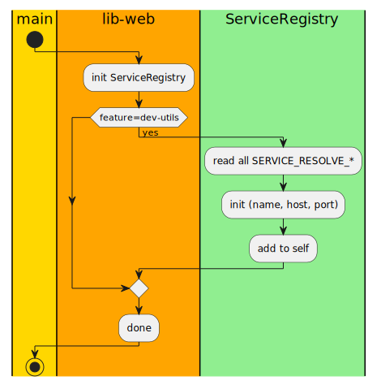

<!-- TOC -->

- [Resolving worker services](#resolving-worker-services)
    - [dev-services.toml](#dev-servicestoml)
    - [reading the resolution data](#reading-the-resolution-data)
    - [High level resolution info load flow](#high-level-resolution-info-load-flow)
    - [Development only crate features](#development-only-crate-features)
    - [Gating dev resolution behind the dev-utils feature](#gating-dev-resolution-behind-the-dev-utils-feature)
    - [Improvement ideas](#improvement-ideas)

<!-- /TOC -->

# Resolving worker services

Anytime we need to call workers, we need to have a way of resolving them. A deployment environment like kubernetes will have it's own way full-featured DNS system. For local development speed however, a much simpler low-fat approach is called-for. 

> 👉 However, even here. We want to make sure that local-devel stuff cannot leak into production code and bring up unpleasant surprises. After a bit of research, turns out, rust has a great way of dealing with it. Akin to different compile flags.

## dev-services.toml

I am keeping the dev service info in a separate toml file at the same level as the main `.cargo/config.toml`. This way, `cargo` will treat it like any other config file.

```
.cargo
├── config.toml
└── dev-services.toml
```

```toml
[env]

# -- ConfigMap / Service DNS resolution
# supply this additional file via `--config dev-services.toml` 
# This is loaded when the bin is built with `--features dev-utils`

SERVICE_RESOLUTION_LLM = '{"name": "llm-worker", "host": "localhost", "port":8081}'
SERVICE_RESOLUTION_VISION = '{"name": "vision-worker", "host": "localhost", "port":8082}'
```

## reading the resolution data

The code for this is under `lib_web/src/_dev_utils/dev_service_registry.rs`. Roughly:

 - modeled as static/singleton after `WebConfig`
 - uses the `envs::get_matching` with a regex
 - deserializes contents from JSON and saves to the `ServiceRegistry`
 - makes `ServiceRegistry` contents available via a new public `resolve_service` method
 - Plenty of _FOR-DEV-ONLY_ in traces so accidental inclusion in production builds will be more readily discovered.

The singleton nature of this _(load on first use, that too only when built with `dev-utils` config flag)_ follows the same pattern as `WebConfig`.

```rust
use std::{collections::HashMap, sync::OnceLock};

fn service_registry() -> &'static ServiceRegistry {
	static INSTANCE: OnceLock<ServiceRegistry> = OnceLock::new();

	INSTANCE.get_or_init(|| {
		ServiceRegistry::load_from_env().unwrap_or_else(|ex| {
			panic!("FATAL - WHILE LOADING Service Resolution Data - Cause: {ex:?}")
		})
	})
}
```

actual registry reading is as follows

```rust
use crate::error::{Error, Result};
use crate::utils::service_resolution::ServiceResolutionData;

use lib_utils::envs;
use regex::Regex;
use tracing::{info, warn};

struct ServiceRegistry {
    pub table: HashMap<String, ServiceResolutionData>,
}

impl ServiceRegistry {
    fn load_from_env() -> Result<ServiceRegistry> {
        info!("{:<12} - Initialize service resolution from config.toml/env", "FOR-DEV-ONLY");

        let mut src_info_map = HashMap::<String, ServiceResolutionData>::new();

        let re = Regex::new(r"SERVICE_RESOLUTION_(.*)").unwrap();			
        if let Ok(hmap) = envs::get_matching(re) {
            for (k, v) in hmap {			
                match serde_json::from_str::<ServiceResolutionData>(&v) {
                    Ok(srd) => {
                        info!("Processing config key: {k}");
                        info!("{:<12} - Service {} → http://{}:{}", "FOR-DEV-ONLY", 
                            srd.name,
                            srd.host,
                            srd.port);					
                        
                        src_info_map.insert(srd.name.clone(), srd);
                    },
                    Err(e) => {
                        warn!("{:<12} - Wrong JSON format for {v:?}. Error = {e:?}", "FOR-DEV-ONLY");
                    },
                };			
            }
        }	
		Ok(ServiceRegistry { table: src_info_map})			
	}    
}

```


## High level resolution info load flow



## Development only crate features

When sticking _dev-environment-only_ code, the least that can be done is to put some sort of compile-time guard around it. Sicne `cargo` does provide ways to distinguish between `production` and `development`, this is straigtforward. The only thing to remember is that production deployment scripts actually use the `production` config when building.

**Add a feature flag to lib-web**

```diff
[package]
name = "lib-web"
version = "0.1.0"
edition = "2021"

+[features]
+dev-utils = []
```

**Add the feature flag to web-gateway**

This is slightly different, as we need to cascade it down to lib-web as well. Note that the mapping is `["dependency/dependency-feature"]`. When `cargo --feature=dev_utils` is used to build `web-gateway`, the `dev-utils` flag is propagated down to `lib_web`.

```diff
[package]
name = "web-gateway"
version = "0.1.0"
edition = "2021"

+[features]
+# - Propagate this down to the dependencies.
+dev-utils = ["lib-web/dev-utils"]
```

## Gating dev resolution behind the dev-utils feature

Once `cargo` passes the new feature flag in, we need code that actually uses it. The way I have done it is to switch a function body to throw an error when not compiled with the needed feature. The code looks like this.

```rust
#[cfg(feature="dev-utils")]
pub(crate) fn resolve_service(srv_name: &str) -> Result<&ServiceResolutionData> {
    service_registry()
        .table
        .get(srv_name)
        .ok_or(Error::ServiceResolutionFailed)
}

#[cfg(not(feature="dev-utils"))]
pub(crate) fn resolve_service(srv_name: &str) -> Result<&ServiceResolutionData> {
    Err(Error::ServiceResolutionFailed)
}
```

The key ofcourse if to have the same function in both cases but with different bodies.

## Improvement ideas

However, I think way of doing it is still a hidden time-bombs.

 - If this ever gets into staging/prod. No way anyone can detect from process lists, cmd line args and manifests
 - error shows up only when running the app at which point it is too late _(Staging will help if adherence to gitops makes stage/prod build and deployment the same)_

What If we keep all dev-only code in a separate process!?

 - Needless cost of IPC for what should be basic like DNS?
 - Maybe deal with it later when it does become a problem.