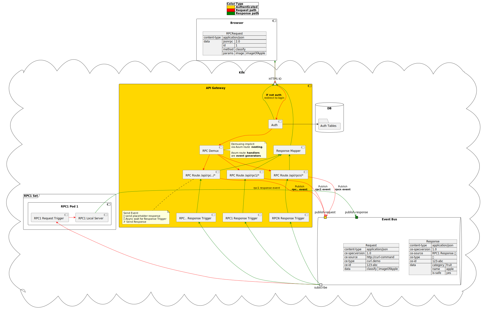

# Rust Web App - Event Driven Architecture

I suspect this is the eventual destination of most web apps: there are many advantages to be had

 - Simplified testing:
   - Unit testing via simplified event generators and output event testers
   -  as you just need the eventbus and the minimum set of participating services to test
 - Higher uptime
   - A use-case that needs N services in sequence, each of which has 99% uptime, will necessarily be 0.99^N in uptime, a number less than 0.99.
   - The same use-case that needs N services, each of which communicate only with the eventbus will have 0.99 * eventBusUptime independent of the number of services involved.

> I am not going down this path yet as my velocity needs outweight any benefits of EDA. Leaving this here as a placeholder.

## Components

The following component diagram assumes `KNative` deployment, hence the `ce-*` encapsulating packets. However, this can be mentally translated into any other eventing system _(like Kafka for eg.)_ as they will likely all have a similar encapsulating json packet.

## Deployment

In addition to the worker deployments, there is atleast an EventBroker (redis/Valkey) etc. that needs to be deployed.

 